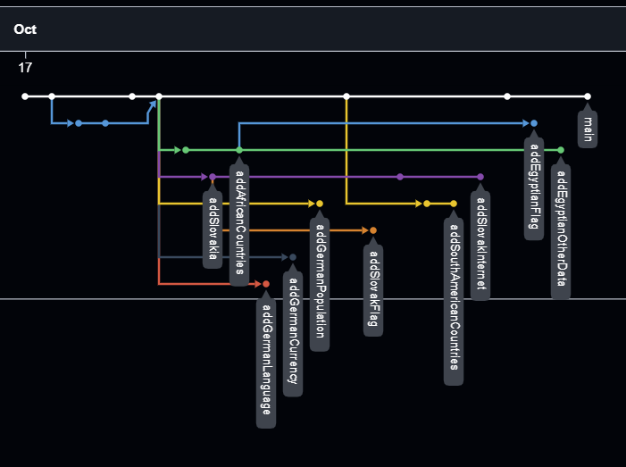

# MANAGING REPOSITORY BRANCHES

The following tasks are designed to help you learn how to use branches in a `git` repository. Perform all tasks in the local repository on your personal computer, using only `git` commands run in a terminal window. To observe changes in the local repository, open a terminal window and a window with the repository contents (Windows Explorer) so that they do not overlap.

## Prepare the Repository

1. Create a copy of this repository (`fork`) in your GitHub account.

1. Display Timeline of the most recent commits to the repository and its network ordered by most recently pushed to. From the top menu, select `Insights`, then `Network`. You should see a commit and branch structure similar to the one below in your repository.

    

1. Clone your copy of the remote `countries` repository to your personal computer.

## Complete the Tasks in Terminal Window

_Note. Perform all tasks in the local repository on your personal computer, using only git commands run in a terminal window._


1. In the `main` branch, add the following Internet domain data to the `Poland.txt` file:

    ```
    Internet: .pl
    ```

1. In the `addSouthAmericanCountries` branch, add the `Brazil.txt` file, containing the data:

    ```
    Capital: Brasília
    Language: Portuguese
    Population: 203,080,756
    Currency: BRL
    ```

1. In the `main` branch, create a branch `addNorthAmericanCountries`. In the created branch, add in the repository the `NorthAmarica` folder and in it the `Canada.txt` file containing the data:

    ```
    Capital: Ottawa
    Language: English and French
    Population: 41,288,599
    Currency: CAD
    ```

1. Merge all branches with the `main` branch (do not delete branches after merging). First, merge branches that refer to the same country or continent. Then, merge them with the `main` branch. If conflicts arise, consider that all information contained in the files is important and must be in the project's main branch.

## Complete the Tasks in Visual Studio Code

1. Perform the same tasks again, but this time use Visual Studio Code.

1. To perform the tasks, first remove the `'countries` repository from both your PC and GitHub.
